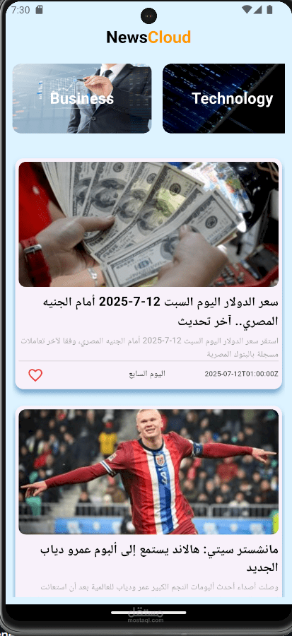

# 📰 NewsCloud App

A real-time news application built with Flutter & Dart that fetches and displays the latest news articles by category with a clean and smooth user experience.

---

# 📸 App Preview



---

# 🚀 About the App

NewsCloud App provides real-time news updates categorized by topics such as technology, sports, business, and more.  
Users can browse articles smoothly and read full news content inside the app using WebView.

This project was built to practice API integration, clean architecture, and advanced Flutter UI design.

---

# ✨ Features

- 📰 Real-time news updates  
- 🗂️ Category-based news filtering  
- 📄 Article details screen  
- 🌐 Full article view using WebView  
- ⚡ Smooth navigation between screens  
- 📱 Responsive UI design  

---

# 🧰 Tech Stack

- Flutter (UI Framework)  
- Dart (Logic & structure)  
- Dio (API requests & networking)  
- webview_flutter (Open full articles inside app)  
- Stateful Widgets (UI state management)  
- Custom Widgets (ArticleItem, CategoryTile, etc.)  
- Model Classes (JSON parsing & structuring)  
- Navigator (Screen navigation)  

---

# 🧱 Project Structure

```bash
lib/
│
├── models/
├── services/
├── views/
│   ├── home/
│   ├── details/
│   └── webview/
│
├── widgets/
├── helper/
└── main.dart
```

---

# 💡 What I Learned

- Structuring Flutter projects using MVC-style architecture  
- Working with REST APIs using Dio  
- Parsing JSON data into model classes  
- Building responsive and scrollable UIs  
- Passing data between screens  
- Integrating WebView inside Flutter apps  

---

# 🎯 Project Purpose

The goal of this project was to strengthen my skills in:

- API integration  
- UI/UX design in Flutter  
- Clean code architecture  
- Real-world app development  

---

# 👨‍💻 Developer

## Kyrillos Ayman

Flutter Developer passionate about building clean and scalable mobile applications.

---

# ⭐ Support

If you like this project, don't forget to give it a ⭐ on GitHub!