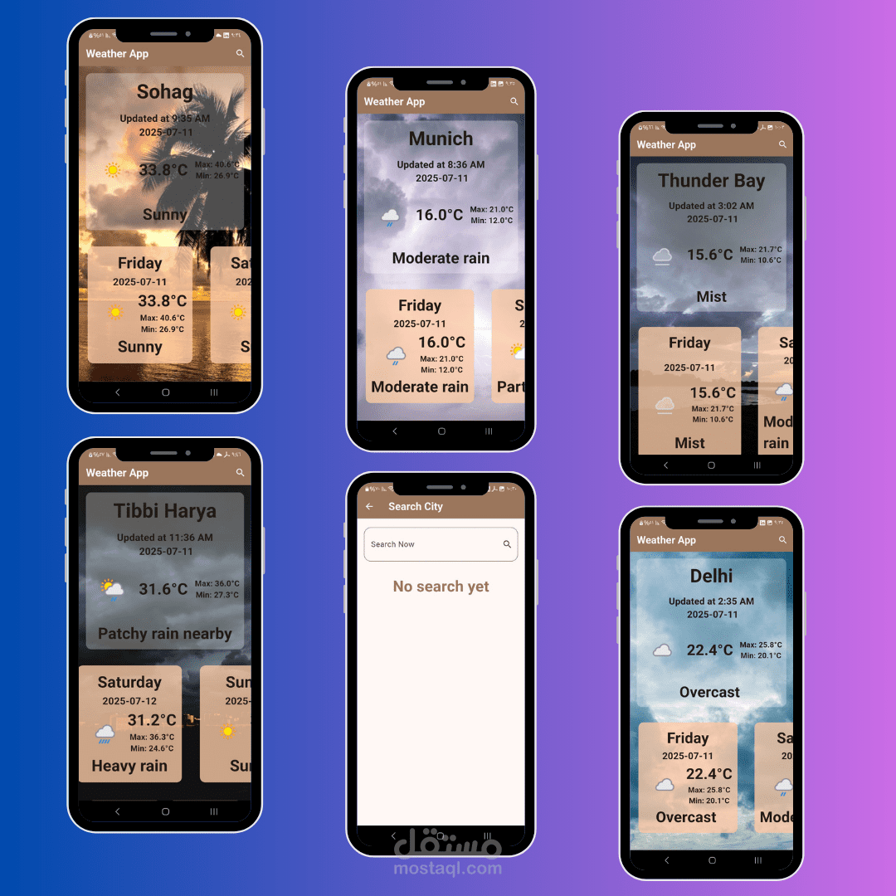

# 🌤️ Weather App

A modern Flutter Weather application that provides real-time weather updates, 3-day forecasts, and dynamic UI that adapts to weather conditions.

---

# 📸 App Preview



---

# 🚀 About the App

This Weather App delivers a smooth and responsive experience with real-time weather data, location-based search, and dynamic visuals that change according to weather conditions.

It was built as a hands-on project to improve Flutter UI design, API integration, and state management skills.

---

# ✨ Features

- 🔥 Real-time weather data  
- 📆 3-day weather forecast  
- 🏙️ City-based search functionality  
- 🌅 Dynamic backgrounds based on weather condition  
- 📲 Fully responsive UI (portrait & landscape)  
- 🔄 Pull-to-refresh for live updates  

---

# 🛠 Tech Stack

- Flutter  
- Dart  
- Bloc (State Management)  
- Dio (API requests)  
- WeatherAPI  
- CachedNetworkImage  
- Intl (Date formatting)  
- CustomScrollView & Slivers  

---

# 🧱 Project Structure

```bash
lib/
│
├── cubits/
├── models/
├── services/
├── views/
├── widgets/
└── main.dart
```

---

# 🎯 Learning Goals

This project helped me improve:

- API integration in Flutter  
- State management using Bloc  
- Building responsive UI  
- Working with dynamic data  
- Structuring scalable Flutter apps  

---

# 🌐 API Used

- Weather API: https://lnkd.in/ejFveBuK

---

# 💡 Why this project?

I built this app to strengthen my skills in Flutter development, especially working with real-time APIs and building clean, user-friendly interfaces.

---

# 🎬 Demo

Video demo available below 👇

---

# 👨‍💻 Developer

## Kyrillos Ayman

Flutter Developer passionate about building clean, scalable, and real-world mobile applications.

---

# ⭐ Support

If you like this project, don't forget to give it a ⭐ on GitHub!
